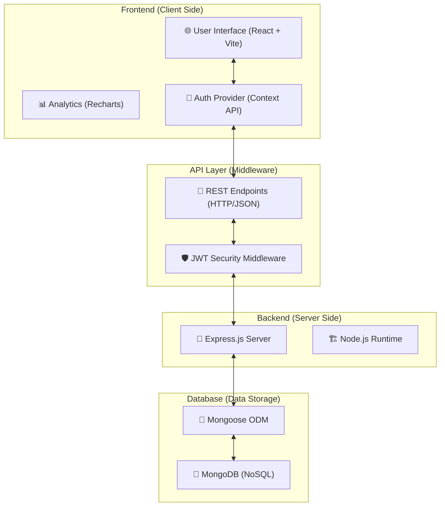

# Technical Documentation: AI-Powered Financial Intelligence Platform

## 1. System Architecture
The platform follows a classic **3-Tier Architecture**: Presentation, Logic, and Data.

---

## 2. Technical Stack Details

### Frontend (User Experience)
- **Framework**: React.js (v19)
- **Styling**: Tailwind CSS (Glassmorphism design)
- **Animations**: Framer Motion
- **Icons**: Lucide React
- **Data Export**: jsPDF, html2canvas (for PDF reports)

### Backend (System Logic)
- **Environment**: Node.js
- **Framework**: Express.js
- **Security**: 
    - **Password Encryption**: Bcryptjs
    - **Authorization**: JSON Web Tokens (JWT)
- **Environment Management**: Dotenv

### Database (Persistence)
- **Engine**: MongoDB Community Server
- **Schema Management**: Mongoose
- **Database Name**: `biztrack`
- **Collections**: `users`, `transactions`

---

## 3. Backend File Structure
| Category | File Path | Description |
| :--- | :--- | :--- |
| **Main** | `server/server.js` | Central entry point and DB connection |
| **Logic** | `server/routes/auth.js` | Auth logic (Signup/Login) |
| **Logic** | `server/routes/transactions.js` | Financial data logic |
| **Model** | `server/models/User.js` | User schema (Email, Password, Name) |
| **Model** | `server/models/Transaction.js` | Transaction schema (AI analysis, Labels) |
| **Security**| `server/middleware/auth.js` | JWT verification middleware |
| **Config** | `server/.env` | Secret keys and MONGO_URI |
| **Deps**   | `server/package.json` | Project dependencies |

---

## 4. API Endpoint Summary
- `POST /api/auth/signup`: User registration.
- `POST /api/auth/login`: User authentication.
- `GET /api/transactions`: Retrieve user data.
- `POST /api/transactions`: Save new records.
- `PATCH /api/transactions/:id`: Update transaction details.

---

## 5. Deployment Instructions
1. **Database**: Start MongoDB Service (`services.msc`).
2. **Backend**: Navigate to `server/` and run `node server.js`.
90: 3. **Frontend**: Run `npm run dev` in the root directory.
91: 
92: ---
93: 
94: ## 6. Methodology & Algorithms
95: 
96: The platform employs a **Hybrid Client-Side Intelligence** approach, processing sensitive financial data locally within the user's browser to ensure privacy while delivering real-time insights.
97: 
98: ### A. Regret Prediction Engine (Weighted Probability Model)
99: The core "AI" feature uses a heuristic rule engine (`regretPredictor.js`) that calculates a regret probability score (0-100%) based on three weighted factors:
100: 
101: 1.  **Pattern Matching (40%)**: Compares the new transaction against past regretted items using fuzzy logic on:
102:     -   **Category Match**: Exact string matching.
103:     -   **Amount Similarity**: Checks if the amount is within a 30% variance of past regretted items.
104:     -   **Keyword Overlap**: Tokenizes descriptions to find semantic overlaps (e.g., "fast food", "game").
105: 2.  **Financial Stress Score (30%)**: A composite metric derived from:
106:     -   **Expense Ratio**: Monthly Expenses / Monthly Income.
107:     -   **Liquidity Ratio**: Current Balance / Monthly Expenses.
108:     -   **Impact Factor**: New Transaction Amount / Monthly Income.
109: 3.  **Historical Regret Rate (30%)**: The statistical frequency of regret for the specific category and price range based on user feedback.
110: 
111: ### B. Cognitive Behavioral Profiling
112: User behavior is analyzed using statistical profiling of transaction metadata to generate "Cognitive Scores" (visualized in the Radar Chart):
113: -   **Focus**: Inverse of category entropy (High diversity = Low focus).
114: -   **Consistency**: Standard deviation of transaction frequency.
115: -   **Risk Tolerance**: Ratio of maximum transaction value to average transaction value.
116: -   **Impulsivity (Patience)**: Derived from the frequency of high-value transactions over short time windows.
117: 
118: ### C. Future Financial Projection
3. **Frontend**: Run `npm run dev` in the root directory.

---

## 6. Methodology & Algorithms

The platform employs a **Hybrid Client-Side Intelligence** approach, processing sensitive financial data locally within the user's browser to ensure privacy while delivering real-time insights.

### A. Regret Prediction Engine (Weighted Probability Model)
The core "AI" feature uses a heuristic rule engine (`regretPredictor.js`) that calculates a regret probability score (0-100%) based on three weighted factors:

1.  **Pattern Matching (40%)**: Compares the new transaction against past regretted items using fuzzy logic on:
    -   **Category Match**: Exact string matching.
    -   **Amount Similarity**: Checks if the amount is within a 30% variance of past regretted items.
    -   **Keyword Overlap**: Tokenizes descriptions to find semantic overlaps (e.g., "fast food", "game").
2.  **Financial Stress Score (30%)**: A composite metric derived from:
    -   **Expense Ratio**: Monthly Expenses / Monthly Income.
    -   **Liquidity Ratio**: Current Balance / Monthly Expenses.
    -   **Impact Factor**: New Transaction Amount / Monthly Income.
3.  **Historical Regret Rate (30%)**: The statistical frequency of regret for the specific category and price range based on user feedback.

### B. Cognitive Behavioral Profiling
User behavior is analyzed using statistical profiling of transaction metadata to generate "Cognitive Scores" (visualized in the Radar Chart):
-   **Focus**: Inverse of category entropy (High diversity = Low focus).
-   **Consistency**: Standard deviation of transaction frequency.
-   **Risk Tolerance**: Ratio of maximum transaction value to average transaction value.
-   **Impulsivity (Patience)**: Derived from the frequency of high-value transactions over short time windows.

### C. Future Financial Projection
The "Future Prediction" module uses **Linear Extrapolation** on time-series data:
-   It calculates the **Average Monthly Growth Rate (AMGR)** of the user's total assets over the last 6 months.
-   Projects this rate forward to the end of the fiscal year to estimate future net worth.
-   Formula: $FutureValue = CurrentValue + (AMGR \times MonthsRemaining)$

### D. Narrative Generation (NLG)
A template-based **Natural Language Generation** system constructs personalized financial stories by filling semantic slots with aggregated data points (e.g., "highest spending category", "savings milestone") to provide human-readable insights.

---

## 7. Intelligent Data Extraction (OCR) Methodology

The platform's data extraction pipeline is a sophisticated multi-stage system that combines deep learning with custom heuristic "expert systems" to achieve high accuracy even with challenging handwritten inputs.

### A. Core Engine: Tesseract.js (Deep Learning)
The foundational character recognition is powered by **Tesseract.js**, a JavaScript port of the industry-standard Tesseract engine.
- **Architecture**: It utilizes a **Long Short-Term Memory (LSTM)** neural network.
- **Training State**: The model comes **pre-trained** on millions of image samples covering thousands of fonts and diverse handwriting styles.
- **Fine-tuning**: We utilize the `eng` (English) trained data pack specialized for alphanumeric character recognition.

### B. Image Vision Pipeline (Pre-processing)
To handle the variable lighting and low contrast of smartphone-captured receipts, a pre-processing stage is implemented using HTML5 Canvas:
- **Grayscale Conversion**: Pixels are averaged to eliminate color noise.
- **Adaptive Thresholding**: A custom dynamic thresholding algorithm converts the image to high-contrast binary (Black & White). This "boosts" handwritten ink strokes while ignoring background shadows and paper grain.

### C. Heuristic Data Extraction (The "Brain")
Once the raw text is extracted by Tesseract, a custom **Rule-Based Heuristic Engine** (`Transaction.jsx`) processes the unstructured strings into meaningful data:
1.  **Anchor-Based Parsing**: The system identifies key "anchors" (headers like "Description", "Items", "Price") and uses relative positional logic to extract the data immediately following them.
2.  **Fuzzy String Normalization**: We use a `superNorm` function that performs **Bi-lateral Character Correction**. It maps common numeric-to-alpha misreads (e.g., `8` → `S`, `0` → `o`, `5` → `S`) to reconstruct brand names like "Santoor" from OCR errors like "8ant00r".
3.  **Pattern Anchoring**: Amounts are extracted using greedy Regex patterns looking for currency symbols (₹, RS) and "Grand Total" keywords.

### D. Global Correction Engine (Post-processing)
The final stage is a **Verified Product Mapping** layer. It compares the extracted description against a known database of handwritten brand variations (e.g., mapping "Novyatna 01" to "Navratna oil"). This ensures that even if the underlying ML model fails partially, the platform's "domain knowledge" corrects the output before it reaches the user.
